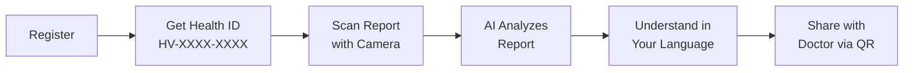
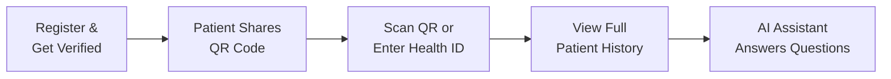
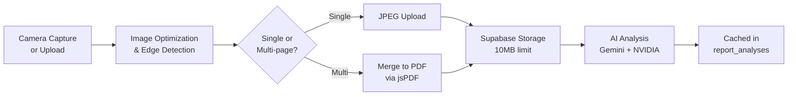
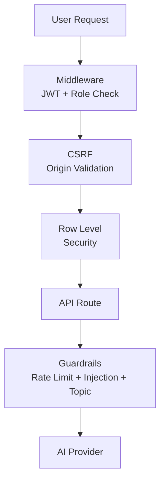
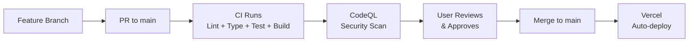

# HealthVault


> **Your health records. Finally in your hands.**

AI-powered medical report management for Indian patients and doctors. Upload reports, get AI-driven insights in 12 languages, and securely share records via a unique Health ID.

---

## The Story

Every year, millions of Indians carry crumpled lab reports in their pockets. They screenshot prescriptions and send them on WhatsApp. They Google "HbA1c 8.2 means" at 2 AM. They repeat their medical history to every new doctor from memory.

Doctors, meanwhile, start every appointment blind. _"Any previous reports?"_ _"I think I have them somewhere..."_ The same blood tests get repeated. The same questions get asked. Time is wasted. Mistakes are made.

**HealthVault exists because your health records should work for you — not get lost in a drawer.**

---

## What HealthVault Does

Upload a photo of any medical report. Our AI reads it, explains it in your language, and makes it instantly shareable with any doctor — using a single Health ID.



**30 seconds. No app download. Works on any phone.**

---

## How It Works for Doctors

No new software to learn. No clinic system to adopt. Just search any patient by their Health ID and see their complete history — with AI-powered insights.



---

## Features

### For Patients

| Feature                  | What It Does                                                                                                                          |
| ------------------------ | ------------------------------------------------------------------------------------------------------------------------------------- |
| **Health ID Card**       | Unique `HV-XXXX-XXXX` ID with QR code, copy-to-clipboard, and WhatsApp share                                                          |
| **Camera Scan**          | Full-screen camera with automatic document edge detection and perspective correction                                                  |
| **Multi-page PDF Merge** | Capture multiple pages and merge them into a single PDF — no more separate files for each page                                        |
| **AI Report Analysis**   | Gemini AI reads your report and provides: summary, key findings, abnormal values, medications, risk assessment, and follow-up actions |
| **Health Interpreter**   | Plain-language explanation of any report in **12 Indian languages** — with text-to-speech so you can listen to it                     |
| **Emergency Card**       | Public QR-accessible card with your blood group, allergies, conditions, and emergency contact — works without login                   |
| **Access Log**           | See exactly which doctors viewed your records and when. Revoke access anytime                                                         |
| **QR Code Share**        | Generate QR, copy ID, share a time-limited link (24h), or send via WhatsApp                                                           |
| **Doctor QR Share Flow** | Scan a doctor's QR code, select which reports to share, done in 3 taps                                                                |
| **Report Management**    | Search, filter by type (prescription, lab report, scan, etc.), star favorites, toggle shareable/private                               |

### For Doctors

| Feature                  | What It Does                                                                                                                                             |
| ------------------------ | -------------------------------------------------------------------------------------------------------------------------------------------------------- |
| **Patient Lookup**       | Search any patient by Health ID with instant validation                                                                                                  |
| **AI Clinical Insights** | Batch-analyze all shared reports — aggregated medications, abnormal values, and risk flags at a glance                                                   |
| **AI Doctor Assistant**  | Floating chat assistant with context of your recent patients. Ask: _"Which patients have abnormal results?"_ or _"What medications are my patients on?"_ |
| **QR Scanner**           | Scan patient QR codes with torch toggle, camera switching, and file upload fallback                                                                      |
| **Verification System**  | NMC scraping, government API verification, and admin review — so patients know you're real                                                               |
| **Shared With Me**       | View all reports shared by patients with type/date filters and AI analysis                                                                               |

### Platform

| Feature                 | What It Does                                                                                                                          |
| ----------------------- | ------------------------------------------------------------------------------------------------------------------------------------- |
| **12 Indian Languages** | Full UI + AI interpretation in English, Hindi, Tamil, Telugu, Marathi, Bengali, Gujarati, Kannada, Malayalam, Punjabi, Odia, Assamese |
| **Dark Mode**           | Full light/dark theme with anti-flash protection and localStorage persistence                                                         |
| **PWA-Ready**           | Installable on any phone — works like a native app                                                                                    |
| **Security**            | Row Level Security on every table, CSP headers, CSRF protection, rate limiting, audit logging, prompt injection detection             |
| **Cron Cleanup**        | Daily job: auto-deletes soft-deleted accounts after 72h, 90-day audit data retention                                                  |
| **Session Management**  | 15-minute idle timeout, auto-logout, back-button access prevention                                                                    |
| **Sentry**              | Production error monitoring with source maps                                                                                          |

---

## Architecture

```mermaid
flowchart TB
    subgraph Client["Frontend — Next.js 16 · React 19 · MUI 9"]
        P[Patient App]
        D[Doctor App]
    end

    subgraph API["API Layer"]
        R1[/analyze-report]
        R2[/interpret-report]
        R3[/doctor-assistant]
        R4[/emergency/:id]
        R5[/extract-report]
    end

    subgraph AI["AI Providers"]
        G[Gemini 2.5 Flash]
        N[NVIDIA NIM Fallback]
    end

    subgraph Data["Data Layer"]
        DB[(Supabase\nPostgres 17)]
        S[Supabase\nStorage]
        Auth[Supabase\nAuth]
    end

    Client --> API
    API --> AI
    API --> Data
    AI -.->|fallback| N
```

### Report Lifecycle



### AI Provider Routing

The system uses a **provider-router** pattern with automatic fallback:

| Task                             | Primary          | Fallback                  |
| -------------------------------- | ---------------- | ------------------------- |
| Vision (report image analysis)   | Gemini 2.5 Flash | NVIDIA phi-4-multimodal   |
| Text (interpretation, assistant) | Gemini 2.5 Flash | NVIDIA nemotron-super-49b |

If Gemini hits rate limits or quota exhaustion, the request automatically retries on NVIDIA NIM — zero downtime.

---

## Security

HealthVault handles medical data. Security isn't optional — it's the foundation.



### What's Under the Hood

| Layer                  | What It Does                                                                                                                                                                                               |
| ---------------------- | ---------------------------------------------------------------------------------------------------------------------------------------------------------------------------------------------------------- |
| **Middleware**         | Validates JWT on every request. Enforces role-based access (patient, doctor, admin). Prevents back-button access after logout                                                                              |
| **CSRF Protection**    | Validates Origin/Referer header on all POST routes. Handles opaque origins and Vercel preview URLs                                                                                                         |
| **Row Level Security** | Every Supabase table has RLS policies. Patients see only their own data. Doctors see only shared reports. Admins have full access                                                                          |
| **AI Guardrails**      | 5-layer defense: file size limits (10MB), per-user rate limiting (20/hr global, 10/route), prompt injection detection (15 patterns), topic enforcement (medical docs only), response validation (max 20KB) |
| **Audit Logging**      | Every AI call, every doctor access, every search attempt — logged to dedicated audit tables                                                                                                                |
| **CSP Headers**        | Strict Content-Security-Policy with frame-src for PDF viewing, report-uri for violation tracking                                                                                                           |
| **Cron Cleanup**       | Daily job executes soft-deletes past 72h grace period, cleans audit data older than 90 days                                                                                                                |

### Database Tables (18 tables across 18 migrations)

| Table                  | Purpose                                                 |
| ---------------------- | ------------------------------------------------------- |
| `profiles`             | User profiles with Health ID, role, language preference |
| `doctor_profiles`      | Doctor credentials, specialization, verification state  |
| `reports`              | Medical reports with file metadata, share/star flags    |
| `report_analyses`      | Cached AI analysis results                              |
| `access_logs`          | Doctor access audit trail                               |
| `shared_reports`       | Patient-to-doctor report sharing                        |
| `emergency_profiles`   | Emergency card data                                     |
| `ai_usage`             | AI rate limiting (per-user, per-route)                  |
| `ai_audit_log`         | AI call audit trail                                     |
| `doctor_verifications` | Verification audit trail                                |
| `upload_attempts`      | Upload rate limiting                                    |
| `consent_logs`         | Terms acceptance tracking                               |
| `admin_audit_log`      | Admin action audit                                      |

---

## Tech Stack

| Layer              | Technology                      | Version                              |
| ------------------ | ------------------------------- | ------------------------------------ |
| **Framework**      | Next.js (App Router, Turbopack) | 16.2.9                               |
| **Language**       | TypeScript                      | 6                                    |
| **UI**             | MUI (Material UI) + Emotion     | 9.0.1                                |
| **CSS**            | Tailwind CSS + Emotion          | 4                                    |
| **Database**       | Supabase Postgres               | 17                                   |
| **Auth**           | Supabase Auth                   | Email/password + Google OAuth        |
| **AI (Primary)**   | Google Gemini                   | gemini-2.5-flash                     |
| **AI (Fallback)**  | NVIDIA NIM                      | phi-4-multimodal, nemotron-super-49b |
| **Storage**        | Supabase Storage                | Private bucket, 10MB limit           |
| **Error Tracking** | Sentry                          | 10.58.0                              |
| **i18n**           | next-intl                       | 4.13.0 (12 languages)                |
| **QR Codes**       | qrcode.react + html5-qrcode     | 4.2.0 / 2.3.8                        |
| **PDF Generation** | jsPDF                           | 4.2.1                                |
| **Sanitization**   | DOMPurify                       | 3.4.10                               |
| **Testing**        | Jest + Testing Library          | 30.4.2                               |
| **Linting**        | ESLint                          | 10                                   |
| **Pre-commit**     | Husky + lint-staged             | 9 / 17                               |
| **CI/CD**          | GitHub Actions                  | ci.yml + codeql.yml                  |
| **Deploy**         | Vercel                          | Auto-deploy from `main`              |
| **Monitoring**     | Dependabot                      | Weekly npm + actions updates         |

---

## Getting Started

### Prerequisites

- Node.js 20+
- npm
- A Supabase project ([supabase.com](https://supabase.com))
- A Google Gemini API key ([aistudio.google.com](https://aistudio.google.com/apikey))

### Setup

```bash
# Clone the repo
git clone https://github.com/sagar-grv/healthvault.git
cd healthvault

# Install dependencies
npm install

# Set up environment variables
cp .env.example .env.local
# Edit .env.local with your Supabase and Gemini keys

# Start development server
npm run dev
```

Open [http://localhost:3000](http://localhost:3000).

### Available Scripts

| Command                 | Description                    |
| ----------------------- | ------------------------------ |
| `npm run dev`           | Start development server       |
| `npm run build`         | Production build               |
| `npm run lint`          | ESLint check                   |
| `npm run typecheck`     | TypeScript check               |
| `npm test`              | Run unit tests                 |
| `npm run test:watch`    | Run tests in watch mode        |
| `npm run test:coverage` | Run tests with coverage report |

### Environment Variables

See [`.env.example`](.env.example) for all required variables.

| Variable                        | Required | Description                                  |
| ------------------------------- | -------- | -------------------------------------------- |
| `NEXT_PUBLIC_SUPABASE_URL`      | Yes      | Supabase project URL                         |
| `NEXT_PUBLIC_SUPABASE_ANON_KEY` | Yes      | Supabase anonymous key                       |
| `SUPABASE_SERVICE_ROLE_KEY`     | Yes      | Supabase service role key (server-side only) |
| `GOOGLE_GEMINI_API_KEY`         | Yes      | Google Gemini API key for AI analysis        |
| `NEXT_PUBLIC_SITE_URL`          | Yes      | Deployed URL (for CSRF, sharing links)       |
| `NVIDIA_API_KEY`                | No       | NVIDIA NIM API key (AI fallback)             |
| `SENTRY_DSN`                    | No       | Sentry DSN for error monitoring              |
| `CRON_SECRET`                   | No       | Shared secret for cron job authentication    |
| `GOV_API_KEY`                   | No       | Government API key for doctor verification   |

---

## Project Structure

```
healthvault/
├── src/
│   ├── app/
│   │   ├── (auth)/              # Login, register, password reset, terms
│   │   ├── (protected)/         # Patient & doctor dashboards
│   │   │   ├── dashboard/
│   │   │   │   ├── patient/     # Patient dashboard, reports, upload, access log, profile
│   │   │   │   └── doctor/      # Doctor dashboard, patients, shared reports, profile
│   │   │   └── onboarding/      # Post-registration onboarding flows
│   │   ├── admin/               # Admin dashboard, doctors, patients, verifications
│   │   ├── api/                 # API routes (AI, cron, emergency, storage, verification)
│   │   ├── emergency/           # Public emergency card page
│   │   └── share/               # Public shareable report link
│   ├── components/
│   │   ├── patient/             # CameraCapture, HealthInterpreter, EmergencyCard, etc.
│   │   ├── doctor/              # DoctorAIAssistant, QRScanner, PatientInsights, etc.
│   │   ├── auth/                # TermsModal
│   │   ├── skeletons/           # Loading skeletons
│   │   └── icons/               # Custom SVG icons
│   ├── lib/
│   │   ├── ai/                  # Gemini integration, guardrails, provider-router, pipeline
│   │   ├── utils/               # Health ID, image optimization, merge-images-to-pdf
│   │   ├── supabase/            # Client, server, middleware, admin
│   │   ├── actions/             # Server actions (consent, etc.)
│   │   └── csrf.ts              # CSRF validation
│   ├── i18n/                    # Locale config, routing
│   ├── middleware.ts             # Next.js middleware entry point
│   └── constants/               # App constants (report types, medical councils, etc.)
├── messages/                    # i18n translation files (12 languages)
├── supabase/                    # Database migrations (18 total)
├── public/                      # Static assets, PWA manifest
├── .opencode/                   # AI development agent protocols
├── docs/                        # Deployment flow, feature specs
├── next.config.mjs              # Next.js config with security headers
├── vercel.json                  # Vercel functions + cron config
└── package.json
```

---

## API Routes

| Endpoint                             | Method | Description                                        |
| ------------------------------------ | ------ | -------------------------------------------------- |
| `/api/analyze-report`                | POST   | Full AI analysis of a medical report               |
| `/api/extract-report`                | POST   | Extract structured data from a report image        |
| `/api/interpret-report`              | POST   | Plain-language explanation in user's language      |
| `/api/explain-report`                | POST   | Explain extracted data in simple terms             |
| `/api/doctor-assistant`              | POST   | Conversational AI for doctors with patient context |
| `/api/emergency/[id]`                | GET    | Public emergency card data (no auth required)      |
| `/api/auth/signout`                  | POST   | Sign out handler                                   |
| `/api/cron/cleanup`                  | GET    | Daily cleanup job (soft deletes, audit retention)  |
| `/api/csp-report`                    | POST   | CSP violation reporting                            |
| `/api/storage`                       | GET    | Signed URL for certificate files (admin only)      |
| `/api/verification/background-check` | POST   | Doctor verification background check               |

All AI endpoints include: CSRF validation, auth check, rate limiting, prompt injection detection, topic enforcement, and audit logging.

---

## Deployment

Push to `main` → Vercel auto-deploys to production.



See [`docs/DEPLOYMENT_FLOW.md`](docs/DEPLOYMENT_FLOW.md) for the full workflow with mandatory user checkpoints.

---

## Branch Strategy

- `main` — Production. Protected by CI gates.
- `feat/*` — Feature branches. Short-lived (max 2 days). Squash merge to main.
- `fix/*` — Bug fix branches.

```bash
git checkout -b feat/feature-name
# ... work, commit, test ...
git push origin feat/feature-name
# Create PR → CI runs → merge → Vercel deploys
```

---

## Contributing

1. Create a feature branch from `main`
2. Make your changes in small, testable increments
3. Run `npm run lint` and `npm test` before committing
4. Push and create a PR — CI will run automatically
5. After review and CI green, merge to main

Pre-commit hooks (Husky + lint-staged) run ESLint and Prettier automatically on staged files.

---

## License

MIT

---

<p align="center">
  <strong>HealthVault</strong><br>
  <em>Future ABDM/ABHA integration ready · Made for India</em>
</p>
