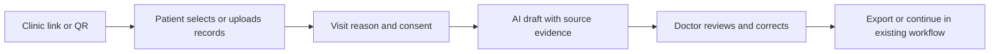

# HealthVault Product Positioning — July 2026

**Status:** product decision and execution plan  
**Repository:** `sagar-grv/healthvault`  
**Decision date:** 18 July 2026

## 1. Product decision

HealthVault will be positioned as an **AI-assisted patient record intake and visit-briefing layer for independent clinics**.

It will not be positioned as:

- a replacement for Aarogya Setu 2.0 or another Personal Health Record app;
- an alternative Health ID or ABHA Number;
- a full EMR, appointment, billing, or hospital-management system;
- an autonomous diagnostic, triage, prescribing, or emergency-priority system.

The product keeps its patient-controlled sharing, multilingual record interpretation, audit trail, and doctor workflow. The commercial buyer becomes the clinic; the patient is the participant and data controller.

## 2. Why the position changed

Aarogya Setu 2.0 launched on 29 June 2026 as a national, citizen-facing PHR with ABHA creation, record management, Scan & Register, AI document digitization, and a personalized dashboard. It began with a distribution advantage of nearly 20 crore downloads. Google also confirmed that the app uses Gemma 4 and the open Medical Data Toolkit to extract data from unstructured records and map it to FHIR.

Primary sources:

- [Government of India launch announcement](https://www.pib.gov.in/PressReleasePage.aspx?PRID=2278988&lang=1&reg=48)
- [Google: AI and FHIR digitization in Aarogya Setu 2.0](https://blog.google/intl/en-in/company-news/india-aarogya-setu-gemma-medical-data-toolkit/)
- [ABDM sandbox documentation](https://sandbox.abdm.gov.in/sandbox/v3/new-documentation)

This removes the viability of “store records, create a Health ID, explain reports with AI, and share with doctors” as a defensible headline.

The clinic market is also mature:

| Product | Established position | Implication for HealthVault |
|---|---|---|
| [Eka Care](https://www.eka.care/) | AI-native health OS, EMR, medical record analyser, scribe, clinical support, ABDM APIs | Do not compete as a broad AI health platform |
| [HealthPlix](https://www.healthplix.com/) | Doctor-first EMR, prescriptions, clinic workflows, multiple specialties and languages | Do not build another full doctor EMR |
| [Practo Ray](https://www.practo.com/providers/clinics/ray) | Clinic management, appointments, payments, records, and ABDM workflows | Do not lead with clinic administration or appointments |
| Aarogya Setu 2.0 | National PHR, ABHA, record digitization, FHIR, government health services | Integrate with the public rails; do not imitate them |

HealthVault therefore needs a narrow workflow wedge: **patient-supplied legacy record reconciliation before a consultation**.

## 3. Ideal customer profile

Start with independent outpatient clinics that have:

- 1–10 clinicians;
- a high proportion of repeat or chronic-care patients;
- paper reports, WhatsApp images, PDFs, or fragmented records from other providers;
- an existing EMR they do not want to replace, or a paper-first workflow;
- an owner-doctor or clinic manager who can approve a pilot quickly.

Initial specialties to test:

1. General medicine
2. Diabetology
3. Cardiology

These specialties are hypotheses, not permanent scope. Retain only the segment that shows recurring use and willingness to pay.

## 4. Job to be done

> Before a consultation, help the clinic reconstruct the patient’s relevant history from scattered records, with patient consent and visible source evidence, so the doctor spends less time searching and more time reviewing the case.

## 5. Positioning statement

For independent Indian clinics that receive patient history as paper reports, PDFs, and WhatsApp images, **HealthVault converts patient-provided records into a consented, reviewable pre-visit record view**.

Unlike government PHR apps and full clinic-management systems, HealthVault is the intake intelligence layer between the patient’s scattered records and the doctor’s existing workflow.

## 6. Public message

### Category

AI patient record intake for independent clinics

### Recommended tagline

**From scattered reports to a doctor-ready visit view.**

### Hero copy

**Know the patient’s story before the visit.**

HealthVault helps patients share paper reports, PDFs, and prior prescriptions before a consultation, so doctors can review an organized record history with consent—without replacing the clinic’s existing system.

### Primary CTA

**Start a clinic pilot**

### Proof points to earn

- works without EMR migration;
- patient-controlled record sharing;
- every access is logged;
- original medical records remain available for review;
- multilingual patient intake;
- designed for future ABDM sandbox integration.

Do not publish unverified claims such as “ABDM compliant,” “clinically validated,” “reduces errors,” “prevents repeat tests,” or “saves X minutes” until evidence exists.

## 7. The minimum commercial workflow

### Required components

1. **Clinic-specific entry point**  
   A QR code or link tied to the clinic or doctor.

2. **Lightweight patient intake**  
   Visit reason, selected records, and optional structured history. Avoid a long registration flow for pilot users.

3. **Explicit sharing receipt**  
   Clinic/doctor, records shared, purpose, time, consent version, and revocation state.

4. **Evidence-linked draft**  
   Every extracted medication, lab value, or finding must point back to the originating report and page where possible.

5. **Doctor review state**  
   Clearly distinguish `AI draft`, `clinician reviewed`, and `corrected`. Store corrections for quality evaluation.

6. **Existing-workflow handoff**  
   Printable PDF and structured export first; EMR or ABDM integration later.

## 8. Product boundaries

### Keep

- patient-controlled report upload and sharing;
- original-document access;
- camera and PDF intake;
- multilingual explanations;
- audit logs;
- doctor verification;
- AI extraction and summarization as a review aid;
- security controls and private storage.

### Simplify

- patient registration;
- internal `HV-XXXX-XXXX` identifier;
- doctor discovery;
- dashboard navigation;
- AI output, focusing on extraction and chronology instead of broad “risk” claims.

### Do not restore now

The emergency-priority queue and automated priority scoring removed from `main` on 18 July 2026 should stay removed. A useful part of the earlier work—the pre-visit intake form—can return only as a smaller clinic-pilot workflow after user testing.

Do not ship automated emergency, criticality, or treatment-priority decisions without clinical governance, validation, and a documented regulatory assessment.

## 9. Safety, privacy, and regulatory gates

### AI scope

The current AI prompt produces risk levels, urgency labels, clinical significance, and specific follow-up actions. A disclaimer alone does not remove the product risk.

For the clinic pilot:

- make extraction and summarization the default;
- preserve the original report as the source of truth;
- require clinician review before a summary is treated as confirmed;
- do not market the system as diagnostic or prescriptive;
- disable consumer-facing emergency or treatment recommendations.

Before expanding into clinical decision support, obtain a formal intended-use and CDSCO classification assessment. CDSCO’s 2025 draft guidance explains that software meeting the Medical Devices Rules definition follows a risk-based licensing pathway: [CDSCO draft guidance on Medical Device Software](https://cdsco.gov.in/opencms/resources/UploadCDSCOWeb/2018/UploadPublic_NoticesFiles/Draft%20guidance%20document%20on%20Medical%20Device%20Software%2021%2010%202025.pdf).

### Privacy

The existing Terms page is not a market-ready privacy notice. Before real clinic pilots, document:

- itemized personal and health data collected;
- each processing purpose;
- storage locations and retention periods;
- processors and AI providers;
- consent withdrawal and record-deletion flow;
- grievance and privacy contact;
- breach-response process;
- policy and consent version history;
- whether model providers retain or train on submitted content.

Build toward the notice and consent requirements in the [Digital Personal Data Protection Rules, 2025](https://www.meity.gov.in/static/uploads/2025/11/53450e6e5dc0bfa85ebd78686cadad39.pdf), noting their staged commencement, and follow the [ABDM Health Data Management Policy](https://abdm.gov.in/strapicms/uploads/health_management_policy_bac9429a79.pdf) for any ABDM ecosystem participation.

Use synthetic or properly de-identified records in demos and evaluation.

### ABDM claims

Until the integration is tested and accepted in the official sandbox:

- say “ABDM sandbox integration planned”;
- do not say “ABDM compliant,” “ABDM certified,” or “ABHA-ready”;
- treat the internal HealthVault ID as an application identifier, not a national health identifier.

## 10. Pilot and go-to-market plan

### Pilot offer

- 3 independent clinics in Maharashtra
- 30 days
- no charge
- white-glove onboarding
- clinic desk QR plus a shareable patient link
- weekly doctor feedback
- synthetic demonstration before any real patient data is used

### What to measure

- number of visit views created per clinic per week;
- percentage opened by a doctor;
- median time from opening HealthVault to usable context;
- percentage of AI items linked to source evidence;
- doctor correction rate by field type;
- patient completion and abandonment rate;
- number of repeat clinic users;
- explicit willingness to continue and pay.

### Commercial gate

Do not call the pilot successful because users registered. Success requires recurring doctor use.

A useful initial gate is:

- at least 2 of 3 clinics use HealthVault every week;
- each active clinic processes at least 20 visit views during the pilot;
- doctors report a clear reduction in record-search effort;
- no unresolved high-severity privacy or safety issue;
- at least 2 clinics agree to a paid continuation.

### Pricing experiment

Do not publish permanent pricing yet. After the free pilot, test two founding-clinic offers:

- ₹999 per clinic per month with a usage allowance;
- ₹1,499 per clinic per month with higher usage and assisted onboarding.

Select pricing based on usage, support burden, AI cost, and willingness to pay—not competitor matching.

## 11. Ninety-day roadmap

### Days 0–14: truth and focus

- reposition landing page and README;
- remove unverified ABDM/compliance claims;
- publish a sample clinic workflow using synthetic data;
- reconcile the incomplete pre-check rollback in code and database migrations;
- close or supersede stale pull requests;
- create a product issue backlog;
- replace the current short Terms page with review-ready privacy and consent documents.

### Days 15–45: visit-view MVP

- clinic/doctor QR entry;
- visit reason plus report selection;
- purpose-specific sharing receipt;
- evidence-linked extraction;
- chronological record view;
- doctor review/correction state;
- PDF export;
- evaluation tests using synthetic and de-identified samples.

### Days 46–70: controlled pilots

- onboard 3 clinics;
- run weekly interviews;
- collect workflow metrics;
- fix patient abandonment and doctor-review friction;
- create the first evidence-backed case study.

### Days 71–90: paid proof

- convert at least 2 pilots;
- lock the first specialty;
- finalize the pricing package;
- begin ABDM sandbox work;
- decide whether to integrate with an incumbent EMR, an ABDM integrator, or both.

## 12. Repository operating rules

1. No direct feature work on `main`.
2. One outcome-focused issue per change.
3. Use short-lived `agent/*`, `feat/*`, or `fix/*` branches.
4. Open draft PRs with product impact, safety impact, validation, and rollback notes.
5. Require lint, typecheck, tests, build, and security checks before merge.
6. Never apply destructive production migrations without a backup, read-only inspection, and explicit approval.
7. Keep README claims synchronized with production behavior.
8. Do not count merged PRs as product traction; track clinic usage and outcomes.

## 13. Immediate backlog

| Priority | Outcome | Deliverable |
|---|---|---|
| P0 | Honest market identity | Landing page, README, and repository description updated |
| P0 | Safe AI scope | Extraction-first prompt and clinician-review labels |
| P0 | Consistent codebase | Finish and verify the pre-check/queue rollback without destructive production action |
| P0 | Pilot privacy readiness | Full privacy notice, consent receipt, processor inventory |
| P1 | Clinic workflow | QR/link → records → visit reason → consent → doctor review |
| P1 | Trustworthy summaries | Source/page evidence and correction tracking |
| P1 | Measurable pilot | Event schema and pilot dashboard |
| P2 | Interoperability | Medical Data Toolkit/FHIR evaluation and ABDM sandbox integration |
| P2 | Distribution | EMR/ABDM-integrator partnership tests |

## 14. Core strategic principle

**Aarogya Setu and ABDM should be treated as infrastructure and distribution context, not as enemies.**

HealthVault wins only if it solves a clinic workflow more narrowly, measurably, and conveniently than a broad PHR or EMR.
